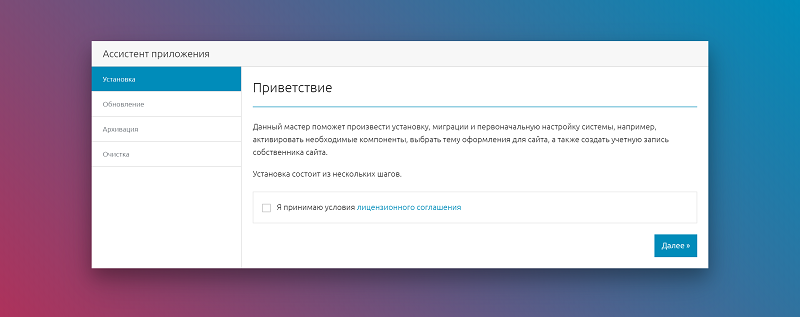

## Ассистент приложения на Laravel 6.x
Ассистент приложения на Laravel 6.x является графической оболочкой для часто используемых команд консоли командной строки и включает в себя несколько пошаговых мастеров:
 - Установщик;
 - Мастер обновлений;
 - Архивариус;
 - Чистильщик.

При создании данного пакета преследовалась цель вынести часто повторяющиеся операции при разворачивании небольших проектов на Laravel.

### Подключение

 - **1** Для добавления зависимости в проект на Laravel в файле `composer.json`

    ```json
    "require": {
        "russsiq/laravel-assistant": "dev-master"
    }
    ```

 - **2** Для подключения в уже созданный проект воспользуйтесь командной строкой:

    ```console
    composer require russsiq/laravel-assistant:dev-master
    ```

 - **3** Если в вашем приложении включен отказ от обнаружения пакетов в директиве `dont-discover` в разделе `extra` файла `composer.json`, то необходимо самостоятельно добавить в файле `config/app.php`:

    - **3.1** Провайдер услуг в раздел `providers`:

        ```php
        Russsiq\Assistant\AssistantServiceProvider::class,
        ```

    - **3.2** Псевдоним класса (Facade) в раздел `aliases`:

        ```php
        'Assistant' => Russsiq\Assistant\Support\Facades\Assistant::class,
        ```

### Публикация файлов пакета

Публикация (копирование) всех доступных файлов для переопределения и тонкой настройки пакета осуществляется через интерфейс командной строки Artisan:

```console
php artisan vendor:publish --provider="Russsiq\Assistant\AssistantServiceProvider"
```

Помимо этого, доступна групповая публикация файлов по отдельным меткам `config`, `lang`, `views`:

```console
php artisan vendor:publish --provider="Russsiq\Assistant\AssistantServiceProvider" --tag=config --force
```

```console
php artisan vendor:publish --provider="Russsiq\Assistant\AssistantServiceProvider" --tag=lang --force
```

```console
php artisan vendor:publish --provider="Russsiq\Assistant\AssistantServiceProvider" --tag=views --force
```

### Краткое описание мастеров

На изображении ниже представлен общий вид Ассистента приложения. Каждый из мастеров состоит из нескольких шагов. Каждый из шагов может быть представлен несколькими экранами: например, экран с вводом данных и экран, отображающий результат.



Каждый из экранов после публикации файлов может быть переопределен в зависимости от ваших предпочтений и требований. Чаще всего требуется простое переопределение строк перевода в языковых файлах.

#### Установщик

Приложение считается установленным только после того как в файле `.env` данным мастером будет прописана дата установки `APP_INSTALLED_AT`. До этого момента Ассистент будет принудительно перенаправлять пользователя на маршрут Установщика.

Данный мастер состоит из следующих экранов:
 - **Приветствие** - экран с краткой вступительной речью и обязательным принятием лицензионного соглашения.
 - **Требования** - проверка на соответствие некоторых настроек сервера минимальным требованиям приложения. Убедитесь, что все пункты будут отмечены зелеными галочками.
 - **База данных** - необходимо указать параметры подключения к предварительно созданной БД.

    При нажатии кнопки <kbd>Далее</kbd> выполняется проверка подключения к БД, применяются миграции, расположенные в директории **database/migrations** вашего проекта.

    Помимо этого возможно наполнение БД как начальными так и фиктивными данными. Наполнители располагайте в директории **database/seeds** вашего проекта. Имена классов указывайте в опубликованном файле конфигурации `config/assistant.php` в разделе `installer.seeds`, где значениями для ключей являются имена классов:
     - `database` - имя класса с начальными данными, например `'DatabaseSeeder'`;
     - `test` - имя класса с тестовыми данными, например `'TestContentSeeder'`.

     > В качестве имени класса принимается только один класс, записанный строкой. Не указывайте массивы!

 - **Миграции и наполнение БД** - информационный экран, отображающий результаты выполнения предыдущего шага.
 - **Общие параметры системы** - завершающий экран установки. Необходимо указать название сайта и набор данных, которые будут записаны в файл переменных окружения `.env`.

    За вывод данного экрана отвечает шаблон `common.blade.php`, который будет доступен после публикации файлов пакета в директории `resources\views\vendor\assistant\install`. Поля ввода, заданные вами в этой форме разделяются на два типа: предназначенные для записи в файл `.env` и не предназначенные для этого.

    Для записи переменных окружения и их значений в файл переменных окружения `.env`, имена полей ввода должны быть в верхнем регистре и в качестве разделителя использовать нижнее подчеркивание, например:

    ```html
    <input type="text" name="SOME_VAR" value="{{ old('SOME_VAR', 'default') }}" />

    <select name="OTHER_VAR">
        <!-- остальная разметка -->
    </select>
    ```

    Поля ввода, имена которых не соответствуют этому правилу **не будут записаны** в файл `.env` и могут использоваться вами для построения бизнес-логики в классе финальной стадии Установщика. Данный класс необходимо предварительно сгенерировать с помощью команды:

    ```console
    php artisan make:before_installed BeforeInstalled --force
    ```

    Эта команда создаст файл `app\Services\Assistant\BeforeInstalled.php`. Укажите Ассистенту, что он должен использовать этот сгенерированный класс финальной стадии Установщика в опубликованном файле конфигурации `config/assistant.php` в разделе `installer`:

    ```
    'before-installed' => App\Services\Assistant\BeforeInstalled::class,
    ```

    >В данном классе:    
    > - вы обязаны самостоятельно выполнить валидацию добавленных вами полей в форме `common.blade.php`;
    > - вы не можете добавлять поля либо изменять значения полей, предназначенных для записи в файл переменных окружения `.env`.

    До того как начнет выполняться указанный вами класс, Установщик дополнит запрос из формы полями `APP_DEBUG`, `APP_URL` (при их отсутствии) и выполнит валидацию следующих обязательных полей:

    ```
    // Режим отладки приложения.
    'APP_DEBUG' => [
        'required',
        'boolean',

    ],

    // Название сайта.
    'APP_NAME' => [
        'required',
        'string',

    ],

    // Ссылка на главную страницу сайта.
    'APP_URL' => [
        'required',
        'url',

    ],
    ```

    В вашем распоряжении также имеется возможность в файле настроек `config/assistant.php` дополнительно указать директории для копирования и создания ссылок:

    ```
    // Копирование директорий: fromDir, toDir.
    'directories' => [
        // 'fromDir' => 'toDir',

    ],

    // Создание ссылок на директории: target => link.
    'symlinks' => [
        storage_path('app/public') => public_path('storage'),

    ],
    ```

### Использование

#### Методы

Все публичные методы менеджера доступны через фасад `Assistant`:

```php
Assistant::someMethod(example $someParam);
```

Список доступных публичных методов:

 - [method](#method-method)

<a name="method-method"></a>
##### `method(): hint`
Описание метода.

#### Пример использования

```php
use Assistant;

// ... code
```

### Удаление пакета из вашего проекта на Laravel

```console
composer remove russsiq/laravel-assistant
```

### Тестирование

Неа, не слышал.

### Лицензия

`laravel-assistant` - программное обеспечение с открытым исходным кодом, распространяющееся по лицензии [MIT](https://choosealicense.com/licenses/mit/).
